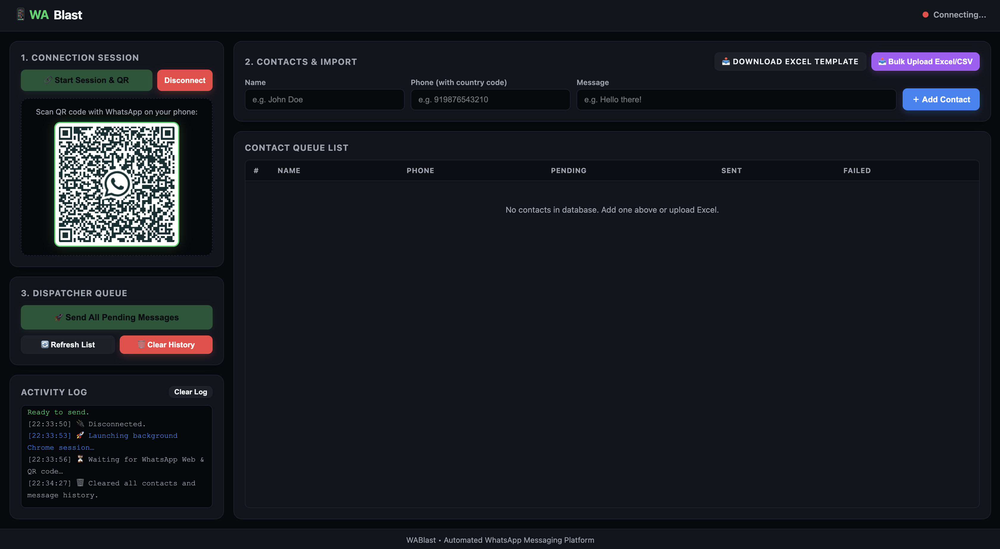

# 📱 WABlast - WhatsApp Bulk Message Sender




**WABlast** is a powerful, modern, browser-based WhatsApp bulk messaging platform built with Python, Flask, and Selenium. It enables users to automate sending bulk customized WhatsApp messages directly via WhatsApp Web **without needing to save contact numbers** in your phonebook.

---

## ✨ Key Features

- ⚡ **Single-Page Dashboard (`100vh`)**: Modern, dark-themed responsive UI designed to fit completely inside a single viewport without outer body scrollbars.
- 📷 **Embedded QR Code Viewer**: Renders WhatsApp Web QR codes directly inside the web UI using headless Chrome. No external Chrome windows cluttering your screen!
- 💾 **Persistent Session Storage**: Saves your WhatsApp login session locally (`chrome_session/`). Scan QR once and stay connected even after server restarts.
- 📥 **Excel & CSV Bulk Import**: Upload `.xlsx`, `.xls`, or `.csv` files with contact numbers and custom message text for automated queuing.
- 📄 **One-Click Excel Template Generator**: Download pre-formatted sample Excel files directly from the UI.
- ⚠️ **Custom Animated Dialogs**: Sleek, glassmorphism modal dialog for confirming dangerous actions like clearing contact history.
- 📊 **Real-Time Activity Log & Queue Tracker**: Monitor message statuses (`Pending`, `Sent`, `Failed`) with live progress logs.
- 🔒 **Privacy First**: Zero personal numbers or hardcoded user credentials stored in the codebase or git history.

---

## 🛠️ Installation & Setup

### Prerequisites
- **Python 3.8+** installed on your system
- **Google Chrome** installed (used by Selenium WebDriver)

### Step 1: Clone the Repository
```bash
git clone https://github.com/Likhith-D-K/WABlast_Whatsapp-Bulk-Messsage-Sender.git
cd WABlast_Whatsapp-Bulk-Messsage-Sender
```

### Step 2: Create & Activate a Virtual Environment

**On macOS / Linux:**
```bash
python3 -m venv venv
source venv/bin/activate
```

**On Windows:**
```cmd
python -m venv venv
venv\Scripts\activate
```

### Step 3: Install Dependencies
```bash
pip install -r requirements.txt
```

---

## 🚀 Running the Application

Launch the server using Python:

```bash
python web_app.py
```

Or run the one-click launch script on macOS/Linux:
```bash
./launch.sh
```

Once launched, your default browser will open automatically at:
👉 **`http://127.0.0.1:5000`**

---

## 📖 How to Use WABlast

```
┌─────────────────┐     ┌──────────────────────┐     ┌─────────────────────┐
│ 1. Connect Session │ ──> │ 2. Add/Import Contacts │ ──> │ 3. Dispatch Messages │
└─────────────────┘     └──────────────────────┘     └─────────────────────┘
```

1. **Connect Session & Scan QR**:
   - Click **`🔗 Start Session & QR`** under Step 1.
   - Wait a few seconds for the QR code to render inside the web page.
   - Open WhatsApp on your phone → navigate to **Linked Devices** → **Link a Device**.
   - Scan the QR code. Once scanned, the status updates to **`Connected ✓`**.

2. **Add or Import Contacts**:
   - **Manual Add**: Enter `Name`, `Phone` (with country code, e.g., `919876543210`), and `Message` in the form and click **`＋ Add Contact`**.
   - **Bulk Import**: Click **`📥 Download Excel Template`** to get a sample template. Fill in your data, then click **`📤 Bulk Upload Excel/CSV`** to import contacts in seconds.

3. **Dispatch Messages**:
   - Click **`🚀 Send All Pending Messages`**.
   - Watch the live activity log and queue status indicators update as each message is delivered!

---

## 📄 Excel / CSV Import Format

Your Excel (`.xlsx`, `.xls`) or CSV (`.csv`) file must contain the following column headers:

| Name | Phone | Message |
|------|-------|---------|
| John Doe | 919876543210 | Hello John! Welcome to WABlast. |
| Jane Smith | 919123456789 | Hi Jane, your notification is ready. |

> **Note**: Phone numbers should include the country code without any `+` or spaces (e.g. `919876543210` for India, `15550199` for US).

---

## 📁 Project Structure

```
├── web_app.py         # Main Flask web app, Selenium controller & REST API
├── app.py             # Alternative Tkinter GUI entrypoint
├── requirements.txt   # Python package dependencies
├── launch.sh          # Quick launcher script for Unix systems
├── .gitignore         # Ignores venv, database, and local Chrome sessions
└── README.md          # Documentation and user guide
```

---

## 🛠️ Built With

- **Python 3** - Core programming language
- **Flask** - Lightweight backend REST API & template renderer
- **Selenium WebDriver** - Browser automation for WhatsApp Web
- **Pandas & OpenPyXL** - Excel/CSV file parsing and template generation
- **SQLite3** - Embedded local relational database for messaging queues

---

## 🛡️ Privacy & Security Disclaimer

This software operates locally on your machine. Your WhatsApp session data (`chrome_session/`) and contact database (`whatsapp.db`) are stored **only on your local computer** and are explicitly excluded from Git via `.gitignore`. No data is uploaded to any external server.

---

## 📜 License

This project is licensed under the MIT License - see the [LICENSE](LICENSE) file for details.